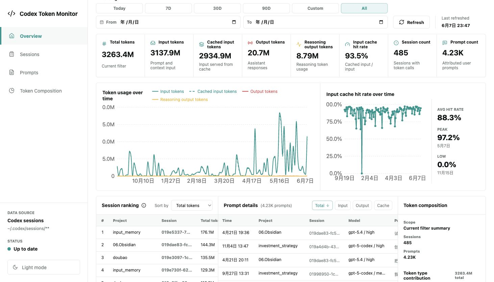

# Codex Token Monitor

Codex Token Monitor is a local-only dashboard for inspecting token usage from Codex session JSONL files.



## What It Does

- Reads local Codex session files from `~/.codex/sessions/**/rollout-*.jsonl`.
- Shows token usage by time, session, prompt, and token composition.
- Keeps data on the local machine. It does not upload session data.

## Quick Start On macOS

1. Install Node.js LTS from `https://nodejs.org/`.
2. Unzip the app folder.
3. Double-click `start.command`.
4. Open `http://127.0.0.1:4317` if the browser does not open automatically.
5. Click `Refresh` in the dashboard.

The terminal window keeps the local server running. Close the terminal window or press `Control-C` to stop the app.

## Command-Line Start

Run these commands from the app folder:

```sh
npm install
npm run build
npm start
```

Then open `http://127.0.0.1:4317`.

## Configuration

The default data source is:

```text
~/.codex/sessions/**/rollout-*.jsonl
```

Optional environment variables:

- `CODEX_SESSION_GLOB`: Override the Codex session JSONL glob.
- `CODEX_TOKEN_DASHBOARD_PORT`: Override the local port. Default: `4317`.
- `CODEX_TOKEN_DASHBOARD_HOST`: Override the host. Default: `127.0.0.1`.
- `CODEX_TOKEN_DASHBOARD_DATA_DIR`: Override the local cache directory.

Example:

```sh
CODEX_TOKEN_DASHBOARD_PORT=4320 npm start
```

## Privacy Boundary

This app is intended to run locally. It scans local Codex JSONL files and stores a local SQLite cache in the user's application data directory. Do not deploy it as a public web service unless the data ingestion model is redesigned.

## Build A Shareable Zip

Run:

```sh
npm run package:share
```

This creates `codex-token-monitor-mvp.zip`. The package includes built `dist/` and `dist-server/` output, plus source files for rebuilding if needed.
